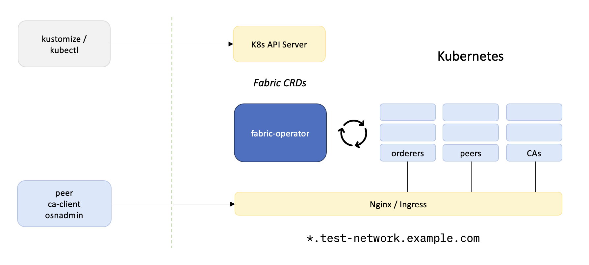

本文档介绍如何通过 fabric operator 创建一个示例的 fabirc 区块链网络。

参考项目：
* https://github.com/hyperledger-labs/fabric-operator

## 1. 部署方式概览
本次介绍的部署方式通过 CRDs、fabirc-operator，利用 K8S API进行快速部署，主要包括以下步骤：

* 通过 kustomization 的覆盖来安装 Operator
* 通过 kustomization 的覆盖来构建 fabirc 网络
* 调用 peer CLI 和 channel 参与的 SDKs 来管理网络
* 部署 Chaincode 及服务（Chaincode-as-a-Service）智能合约
* 在本地工作站开发网关客户端应用

基本架构如下图所示：
  

* 支持在 MacOS 及 Linux 上进行部署（对于远程 K8S，需要复制对应的 kubeconfig 文件到部署机器）
* 在 K8S v1.20 及以上版本上验证通过。

## 2. 准备工作

* Kubernetes（可以是通过 kind 部署，或者已有的 k3s、k8s集群)
* kubectl（和 K8S API交互，需要对应权限的配置）
* helm 工具，[安装方式](https://helm.sh/docs/intro/install/)
* jq（需要进行命令行结果的解析）
* Fabric 二进制命令工具 (peer, osnadmin 等)，建议添加到系统 PATH 下（参见 fabric-release-files 目录下）

下载 fabir-operator 的代码：
```
git clone https://github.com/bestchains/farbic-installer.git
```
注意：
1. 如果没有使用默认的 namespace test-network，则需要修改 sample-network/config 下的 yaml 文件，把 test-network 修改为自定义的 namespace

## 3. 部署 Ingress Nginx
1. fabric-operator 依赖 Ingress 来暴露 fabric 的相关服务，并使用通用的 DNS 匹配域名，比如 *.test-network.fabric.com. 为了后续的部署，我们先单独部署一个 Ingress Nginx。

如果当前集群已经部署了 Ingress Nginx，需要检查以下配置：

1）ingress controller 默认已经配置了 [ssl-passthrough](https://kubernetes.github.io/ingress-nginx/user-guide/tls/#ssl-passthrough)，来支持在node endpoint上的TLS 终止。

在已经具备以上需求的集群上，可以忽略本步骤

1. 开始部署 ingress nginx，编辑 installer/ingress-nginx-chart 下的 values.yaml，主要是标记为“修改”的位置
```yaml
ingressNginx:
  # Enable the expected ingress nginx version
  # Set enableV130 or enableV044 to true, at most one can be true, or both false
  enableV130: &enableV130
    true # 设置为 true
  enableV044: false
  image: &image
    # 修改: ingress nginx 的镜像地址
    hyperledgerk8s/ingress-nginx-controller
  tag: &tag
    v1.3.0
  # 修改: 部署 ingress nginx 的主机名，以便分配到指定节点上
  deployedHost: &deployedHost
...
# Overwrite ingress-nginx chart template
ingress-nginx:
  enabled: *enableV130
  controller:
    ingressClassResource:
      name: *name
    ingressClass: *name
    image:
      repository: *image
      tag: *tag
    admissionWebhooks:
      enabled: true
      patch:
        enabled: true
        image:
          # 修改: kube-webhook-certgen 的镜像地址
          registry: "hyperledgerk8s"
          image: kube-webhook-certgen
          digest: ""
    extraArgs:
      enable-ssl-passthrough:
      update-status:
      report-node-internal-ip-address:
      http-port: 8080
      https-port: 6443
      ssl-passthrough-proxy-port: 16443
```
3. 部署 ingress nginx
```
cd installer/ingress-nginx-chart
kubectl create ns test-network
helm install ingress-nginx --namespace test-network . 
# 检查部署后的状态，确保均处于 Ready 状态
kubectl get pod -n test-network
```

## 4. 部署示例的 Fabric 网络
1. 设置环境变量及配置
```
cd farbic-installer/sample-network
# 设置集群信息
export TEST_NETWORK_CLUSTER_RUNTIME="k3s"
export TEST_NETWORK_STAGE_DOCKER_IMAGES="false"
export TEST_NETWORK_STORAGE_CLASS="openebs-hostpath"
```

修改 network.sh
```
# 主要是配置为 K8S 集群能够访问的镜像及仓库地址，比如默认使用 docker hub 的 hyperledgerk8s.
context FABRIC_CONTAINER_REGISTRY hyperledgerk8s
```

2. 初始化集群
```
./network cluster init
```
3. 启动 operator，通过 kustomize 来部署网络所需的 CAs, peers, orderers
注意，如果是远程部署（部署工具和K8S不在同一个网络，需要配置本地的 hosts）
```
# hosts 文件示例
# ingress 节点 IP       各个组织 ca 的访问地址
172.22.96.209        test-network-org0-ca-ca.localho.st,test-network-org1-ca-ca.localho.st,test-network-org2-ca-ca.localho.st
```
开始部署
```
./network up
```
4. 检查相关资源及状态，包括 pod、deployment、service、ingress等等
```
kubectl -n test-network get all
```
5. 部署管理控制台
```
./network console up
```

按照提示，同样把 console的 ingress 地址配置到 hosts 文件中，以便可以从浏览器直接访问
```
# hosts 文件示例
# ingress 节点 IP       console 的访问地址
172.22.96.209       test-network-hlf-console-console.localho.st
```

6. 确认服务状态正常
```
$ kubectl get pod -n test-network
NAME                                       READY   STATUS    RESTARTS   AGE
fabric-operator-5f675c54cc-hkqbq           1/1     Running   0          59m
hlf-console-5456764dd7-2dm7g               4/4     Running   1          3m47s
ingress-nginx-controller-f68f5f945-7k48m   1/1     Running   0          59m
org0-ca-7dd5c4c88b-mmn8b                   1/1     Running   0          58m
org0-orderersnode1-6dcd858cf8-r6gtx        2/2     Running   1          51m
org0-orderersnode2-69d5f47c88-rbt9h        2/2     Running   0          51m
org0-orderersnode3-6987c6548b-j4vhf        2/2     Running   1          51m
org1-ca-b9975f4c4-pqhgj                    1/1     Running   0          58m
org1-peer1-5ccdf7f99b-bfk8c                2/2     Running   0          49m
org1-peer2-69cc68d7bd-lqprn                2/2     Running   0          48m
org2-ca-556c6f4c7d-ngpw4                   1/1     Running   0          58m
org2-peer1-775696ccb7-qdc8w                2/2     Running   0          48m
org2-peer2-5c8f857677-9cw9b                2/2     Running   0          48m
```

## 5. 可能碰到的问题：
1、couchdb 没有初始化
相关错误日志：
```
[info] 2022-10-27T04:24:36.936946Z nonode@nohost <0.343.0> -------- Apache CouchDB has started on http://any:5984/
[notice] 2022-10-27T04:24:36.987173Z nonode@nohost <0.366.0> -------- chttpd_auth_cache changes listener died because the _users database does not exist. Create the database to silence this notice.
[error] 2022-10-27T04:24:36.987729Z nonode@nohost emulator -------- Error in process <0.367.0> with exit value:
{database_does_not_exist,[{mem3_shards,load_shards_from_db,"_users",[{file,"src/mem3_shards.erl"},{line,400}]},{mem3_shards,load_shards_from_disk,1,[{file,"src/mem3_shards.erl"},{line,375}]},{mem3_shards,load_shards_from_disk,2,[{file,"src/mem3_shards.erl"},{line,404}]},{mem3_shards,for_docid,3,[{file,"src/mem3_shards.erl"},{line,97}]},{fabric_doc_open,go,3,[{file,"src/fabric_doc_open.erl"},{line,39}]},{chttpd_auth_cache,ensure_auth_ddoc_exists,2,[{file,"src/chttpd_auth_cache.erl"},{line,198}]},{chttpd_auth_cache,listen_for_changes,1,[{file,"src/chttpd_auth_cache.erl"},{line,145}]}]}
```
可以进行手动初始化：
```
$ curl <couchdb_ip>:5984
{"couchdb":"Welcome","version":"2.1.1","features":["scheduler"],"vendor":{"name":"The Apache Software Foundation"}}
$ curl -X PUT http://admin:password@<couchdb_ip>:5984/_users
{"ok":true}
$ curl -X PUT http://admin:password@<couchdb_ip>:5984/_replicator
{"ok":true}
$ curl -X PUT http://admin:password@<couchdb_ip>:5984/_global_changes
{"ok":true}
```

2. operator 代码中依赖的镜像位置

部署的 ca、peer等使用的镜像地址，通过 fabric-operator:v2.4.7-bestchains 镜像可以支持配置镜像地址，配置 env IMAGE_SERVER_ADDRESS_AND_REPO 来实现，默认为 "hyperledgerk8s"，即通过 docker hub 下的 hyperledgerk8s 仓库组进行镜像拉取，并且 bestchains 镜像将依赖镜像统一从该仓库组下载。

参考文档：
1. https://github.com/hyperledger-labs/fabric-operator/tree/main/sample-network
